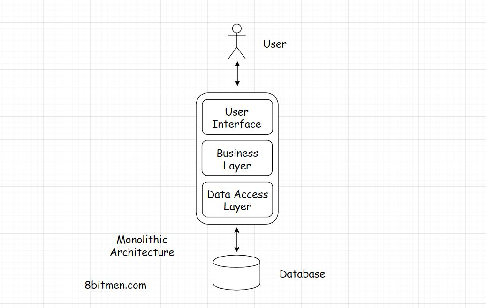

## Project One

For this project, you will need to implement a macroservice architecture. 

You will use:
* S3
* IAM
* Code Pipeline/build/deploy or use Jenkins

The goal of this project is to: 
* Get access to AWS account
* Use roles and policies if necessary
* Use AWS console to naviagate
* Learn the purpose of a deployment pipeline

At the end of this project you should be able to answer the following questions:
* Can your application scale with 1 million users concurrently?
* How would you measure the latency of your application?
* Are you handling high availability? Do you have redundancy for your databases?

## Part 1 : upload to S3
#### Project description
Upload the website provide in the `upload` directory. Create a custom domain name and point it to your S3 buket. 

## Part 2 : continously delivery
#### Project description
Change the description on the main page from `World's leading learning company` to `Space: the final frontier. These are the voyages of the starship Enterprise. Its five-year mission: to explore strange new worlds, to seek out new life and new civilizations, to boldly go where no man has gone before.`
Here's the catch. You cannot manually upload the change to S3. Instead, create a repo on AWS Code Commit, commit your source code there. Build a pipeline using AWS's deployment tool to publish your changes after every commit.

### What Is A Monolithic Architecture? 

A monolithic application is a self-contained, single-tiered software application unlike the microservices architecture, where different modules are responsible for running respective tasks and features of an app.

The diagram below represents a monolithic architecture:

   

In a monolithic web-app all the different layers of the app, UI, business, data access etc. are in the same codebase.

We have the Controller, then the Service Layer interface, Class implementations of the interface, the business logic goes in the Object Domain model, a bit in the Service, Business and the Repository/DAO [Data Access Object] classes.
