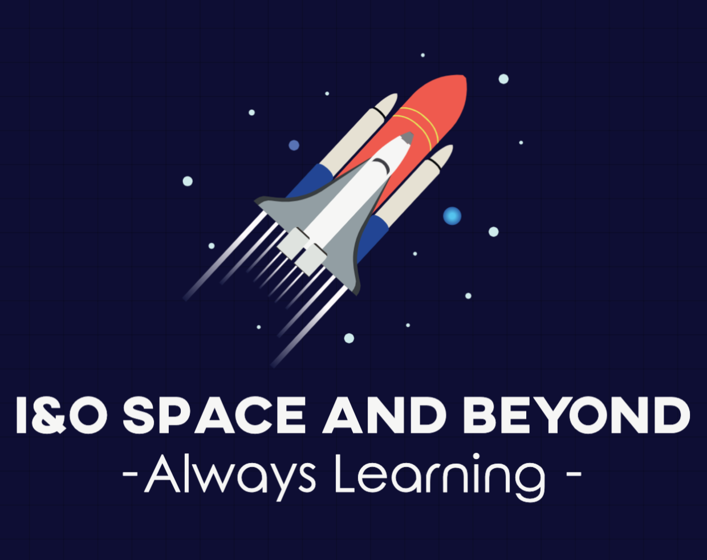

### Howdy!
   

Congratulations on joining the Pearson I&O intern program. We are delighted to have you among us. We are all  excited about your input and contribution to our company. We hope you will walk away with an amazing experience at the end of your program.

To get started, we have developed 4 projects that will help you explore the tools and services that we use at Pearson.

To make things exciting, we will simulate a space program workflow.

### Project One - Gather the team
It's year 2021. Looks like "Space Force" failed to take off. Like Elon Musk, you have decided to start a Space program at Pearson. Your first step would be to create a S3 static webpage. You will find all the files required on the Project-One directory. This static page would be used to hire new team members to your space program. Good luck.

[See here details](./Project-One/README.md) 
### Project One Alpha - Deploy payload
Now that you have created a website, you are getting numerous calls about your program. However, you noticed that the email address is wrong. You want to automate the process - when you check in your code to the repository, it should automatically deploy to S3. Create a pipeline in Jenkins/AWS CodeDeploy to automate the deployment process. <!-- should we use code build & code pipeline? -->
#### Goals
* Get access to AWS account
* Use roles and policies if necessary
* Use AWS console to naviagate
* Learn the purpose of a deployment pipeline

### Project Two - Distribute the work
Now you will have to create an application that will that will register an astronaut and their hours that they have logged. In your Project Two folder, you will find the necessary files and instruction to architect this infrastucture. In your architecture, you will use the following resources:
* ECS Fargate
* RDS Database <!-- or dynamo -->
* ALB

#### Goals
* Create a bigger architecture with end to end process
* Database should handle CRUD operation
* Observe how scaling works with an ALB
* Learn the how to use internal vs external network

[See here details](./Project-Two/README.md) 
### Project Three - Monitor everything
Looks like your astronauts are ready for lift-off. During the entire mission, we need to monitor all our resources and services. For your final mission, you have to create a status dashboard that monitors all services at Pearson. Each status for  each service has to be updated every 15 minutes. You need a status page to monitor - Gilligan, Bitbucket, Jenkins and other essential services used by product teams. For this final mission, you will be working with the Release Engineering team. They will be your resource as many of these services are controlled by their team. 

[See here details](./Project-Three/README.md) 

### SRE Topics
## Programming Languages (presented by Andrew Bagan)
* Your day-to-day activities will involve managing infrastucture (as code), configuration and delivery  
* However, once in awhile you will need to do some form of scripting to deliver a product 
* In this presentation, you will learn some useful languages to make your SRE life easier

## It's not Digiorno, it's delivery - Continuous Integration and Delivery (presented by Warren Veerasingam)
* Let's indulge ourselves in the world of continuous integration and delivery (CI/CD)
* What's a build job?  
* What's a delivery pipeline?  
* What are the different stages of the pipeline?  
* If I messed up, how to revert?  
* In this presentation, you will the tricks and trade of publishing a product. 

## Infrastucture as Code (presented by Jessica Luerkens)
* What Is It? 
* Why Is It Important?
* How is infrastructure traditionally managed?  
* How do we take the process - how do we take that and capture that in a codified way?​ 
* So if I need to do it one time, ten times, or a thousand times, I can automate that.​
* In this presentation, you will learn about terraform and terragrunt.   

## Shipping Containers - Docker and AWS presentation (presented by Harsha Pitawela)
* What Is Docker? 
* Why use Docker for containers?   
* VMs VS Containers?
* In this presentation, you will learn about Docker and how we use in our AWS environment.  

[Presentation Slides](./Presentations) 
